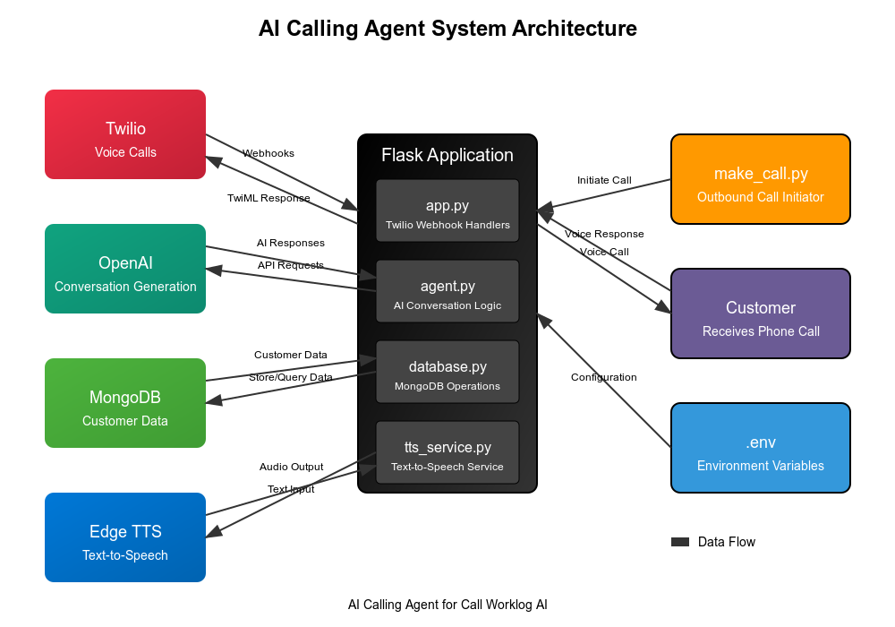

# AI Calling Agent for Call Worklog AI

An automated calling solution that uses AI to make sales calls for Call Worklog AI product, assist with customer queries, and update customer information in a database.

## Overview

This AI Calling Agent makes outbound calls to potential customers to sell "Call Worklog AI" - a tool that automatically generates work logs based on actual work performed. The agent can also handle customer queries and record call outcomes in a database for follow-up and analysis.

## System Architecture



## Features

- **AI-Powered Sales Calls:** Uses OpenAI to generate natural, persuasive sales conversations
- **Outbound Call Automation:** Leverages Twilio for making automated outbound calls
- **Customer Query Resolution:** Answers questions about the Call Worklog AI product
- **Call Recording & Analysis:** Records call outcomes and customer responses
- **Database Integration:** Updates customer information in MongoDB after each call

## Project Structure

```
AI-Calling-Agent/
├── make_call.py          # Script for making a single outbound call
├── requirements.txt      # Project dependencies
└── src/
    ├── .env              # Environment variables (create from .env.example)
    ├── .env.example      # Example environment variables
    ├── agent.py          # AI agent logic using OpenAI
    ├── app.py            # Main Flask application with Twilio webhook handlers
    ├── database.py       # MongoDB database operations
    └── tts_service.py    # Text-to-speech service using Edge TTS
```

## Technology Stack

- **Twilio:** For handling outbound calls
- **OpenAI:** For generating natural conversation and understanding customer responses
- **MongoDB:** For storing customer information and call outcomes
- **Text-to-Speech (TTS):** For converting AI responses to voice using Edge TTS
- **Speech-to-Text (STT):** For converting customer speech to text (handled by Twilio)
- **Flask:** Web framework for handling Twilio webhooks

## Setup Instructions

For quick setup:

1. Clone this repository
2. Create and activate a virtual environment
3. Install dependencies: `pip install -r requirements.txt`
4. Configure your environment variables in `src/.env`
5. Start the Flask application and make test calls

For detailed setup instructions, including Twilio configuration and local testing with ngrok, see [SETUP_GUIDE.md](SETUP_GUIDE.md).

## Running the Application

### Start the Flask Application

From the project root directory:

```bash
cd src
flask run
```

The Flask server will start on port 5000 (or the port specified in your .env file).

### Making a Test Call

Use the provided script to make a test call:

```bash
python make_call.py
```

This will initiate a call from your Twilio number to the phone number specified in the PERSONAL_PHONE environment variable.

## API Endpoints

- **POST /handle-call**: Webhook endpoint for Twilio to handle incoming call events
- **POST /call-status**: Webhook endpoint for Twilio to report call status updates
- **POST /outbound-call**: Endpoint to initiate a single outbound call
- **POST /initiate-calls**: Endpoint to initiate calls to all customers in the database

## Troubleshooting

1. **Webhook Errors**: Ensure your ngrok URL is correct in the .env file and Twilio can reach it
2. **Twilio Errors**: Check your Twilio console for error messages and logs
3. **Audio Issues**: Verify TTS settings and that audio files are being generated correctly
4. **Database Connection**: Ensure MongoDB is running and the connection string is correct

## Development Notes

- The AI agent uses OpenAI's API to generate responses based on conversation context
- Call recordings and transcripts are stored in MongoDB for analysis
- The TTS service converts AI responses to audio using Edge TTS
- Twilio handles the actual phone calls and audio streaming
